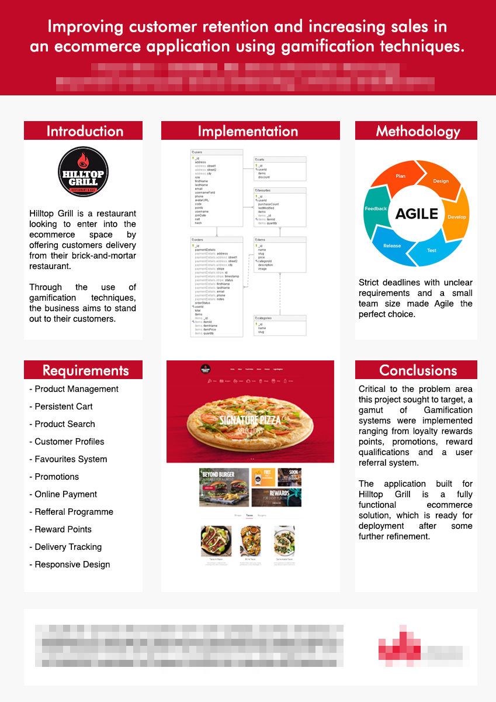
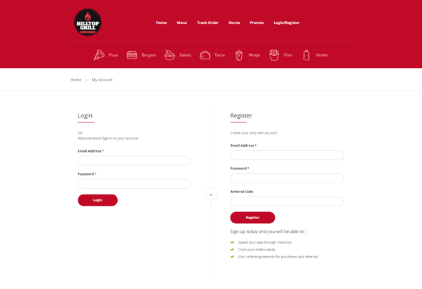
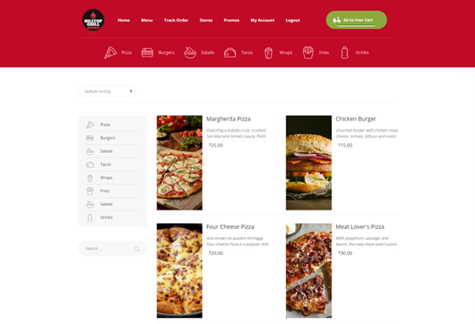
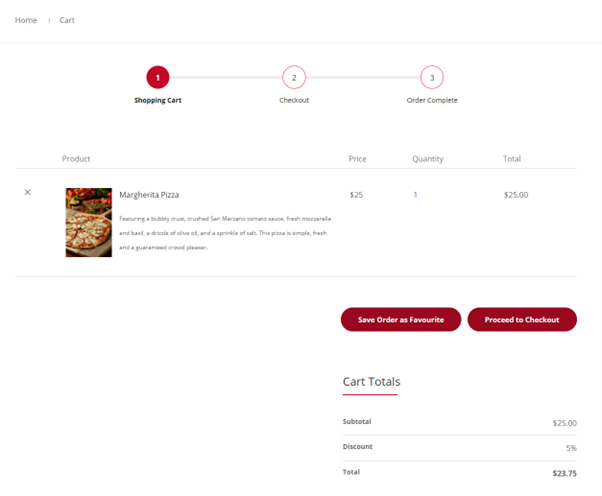
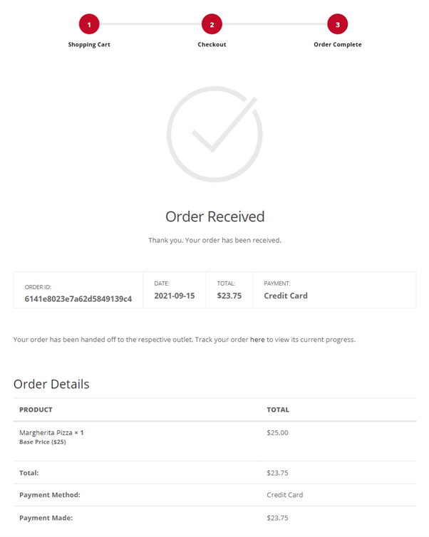
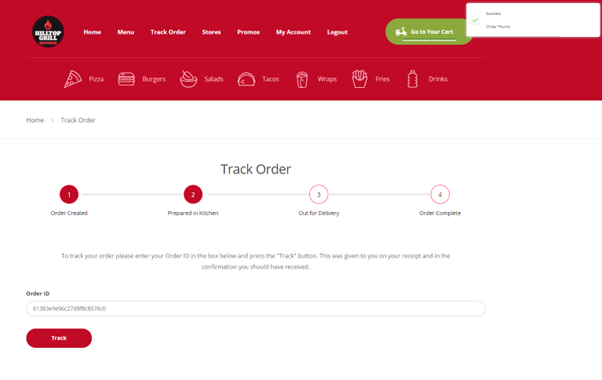
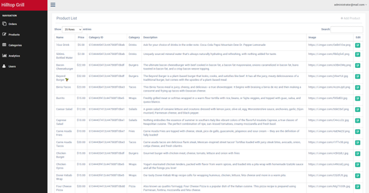
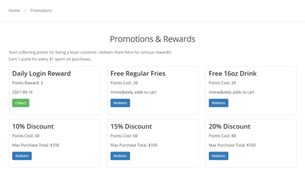

# UNDERGRADUATE THESIS

Using gamification techniques to improve customer retention and increase sales in an ecommerce application.

## Abstract

The effect of the COVID-19 pandemic on the food service industry has driven businesses away from traditional brick-and-mortar locations, and towards the online space by offering food delivery from their restaurants. To remain competitive in an emerging ecommerce space, restaurants must implement new features and systems to acquire and retain customers. Competing against food delivery services, a restaurant seeking to stand out in the market must deliver many of the same services with an added incentive to the customer. This project focuses on the development and implementation of gamification techniques to improve customer retention rates and increase the overall sales the business may see.

## Functional Requirements

| ID   | Requirement                 | Priority (P1-P4) | Requirement Type | Completion |
| :--- | :-------------------------- | :--------------- | :--------------- | :--------- |
| FR1  | User Authentication         | P1               | Core             | 100%       |
| FR2  | User Roles & Management     | P1               | Core             | 100%       |
| FR3  | Administrator Dashboard     | P1               | Core             | 100%       |
| FR4  | Customer Profile Management | P3               | Core             | 100%       |
| FR5  | Order Management            | P2               | Core             | 100%       |
| FR6  | Wish List Management        | P3               | Core             | 100%       |
| FR7  | Product Listing             | P1               | Core             | 100%       |
| FR8  | Product Management          | P1               | Core             | 100%       |
| FR9  | Promotional Items           | P3               | Core             | 100%       |
| FR10 | Product Details             | P1               | Core             | 100%       |
| FR11 | Product Search              | P4               | Core             | 100%       |
| FR12 | Online Payment              | P2               | Core             | 100%       |
| FR13 | Cart Management             | P1               | Core             | 100%       |
| FR14 | Gamification Systems        | P2               | Core             | 100%       |
| FR15 | Email Notifications         | P4               | Advanced         | 100%       |
| FR16 | Geolocation                 | P4               | Advanced         | 50%        |
| FR17 | Delivery Tracking           | P2               | Advanced         | 100%       |
| FR18 | Ecommerce Analytics         | P2               | Advanced         | 60%        |
| FR19 | Referral Programme          | P1               | Advanced         | 100%       |
| FR20 | Responsive Design           | P1               | Advanced         | 100%       |
| FR21 | Single Page Application     | P1               | Advanced         | 80%        |

## Poster

## Screenshots

